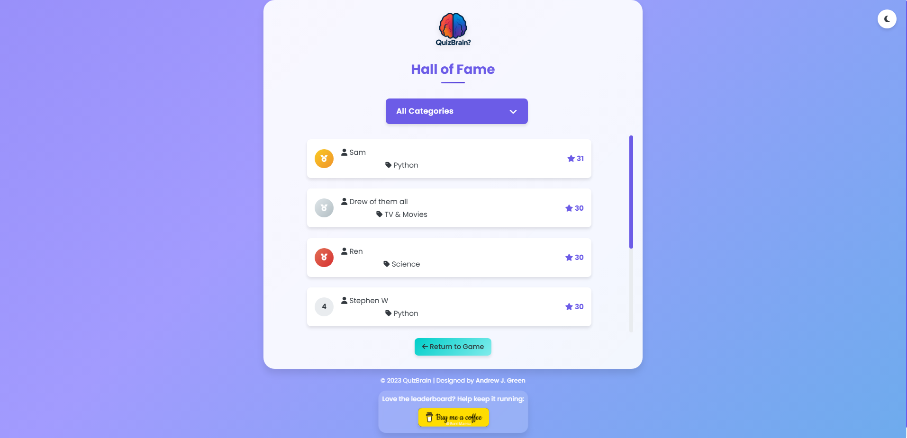

  
  <h1>QuizBrain</h1>
  
A premium, interactive trivia game with multiple categories

  

  

    <a href="#features">Features</a> •
    <a href="#how-to-play">How to Play</a> •
    <a href="#categories">Categories</a> •
    <a href="#leaderboard">Leaderboard</a> •
    <a href="#support">Support</a>
  

## ✨ Features

- 🧠 Test your knowledge across multiple categories
- ⏱️ Race against the clock with our timer-based gameplay
- 🏆 Compete for high scores on our global leaderboard
- 🌐 Play anywhere with our responsive web design
- 🎮 Simple True/False gameplay that's easy to learn but hard to master

## 🎮 How to Play

1. Select a category
2. Answer True/False questions before the timer runs out
3. Each correct answer adds time to your clock
4. Five incorrect answers ends your game
5. Submit your score to the leaderboard

## 📚 Categories

- Random
- Python
- Movies and TV Shows
- History
- Geography
- Pop Culture
- Sports
- Science
- Math

## 🏆 Leaderboard

Our global leaderboard tracks the highest scores across all categories:

## 💖 Support

If you enjoy QuizBrain, please consider supporting the developer:

## 📝 License

This project is licensed under the MIT License - see the LICENSE file for details.

---

  Made with ❤️ by <a href="https://github.com/rorrimaesu">Andrew J. Green</a>

